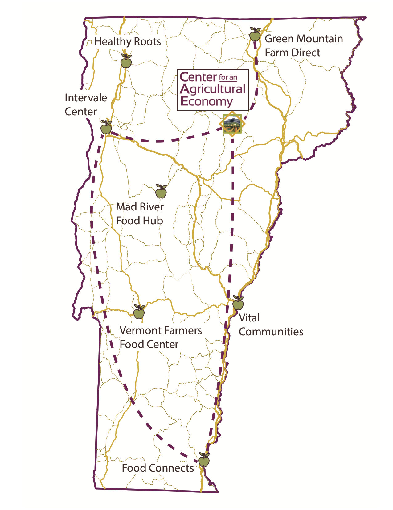
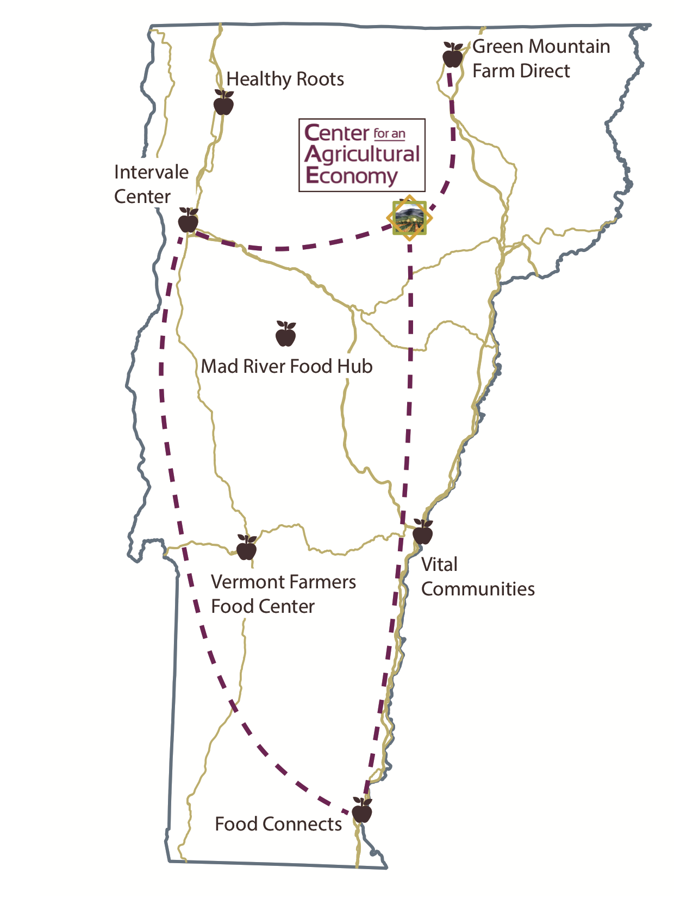
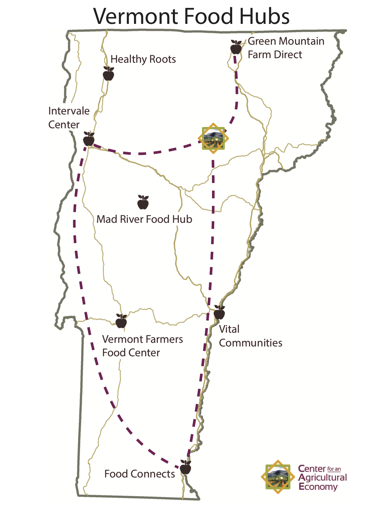

### Food Hubs Maps Updates

10/19/20 - Several Ideas/Drafts
[10/19/20 leaflet](qgis2web_2020_10_19-16_28_09_466638/index.html) - need to see if I can get in and edit the HTML code with more success than through QGIS

|                        Various Ideas                 |                                                      |
| ---------------------------------------------------- | -----------------------------------------------------|
|   |   |
|   |   |

[10/6/2020](qgis2web_2020_10_05-14_53_10_802125/index.html) Map Version
- Contains popups with names, addresses, and website URLs
- Do we wamt different symbols? haven't been able to change the color so far
